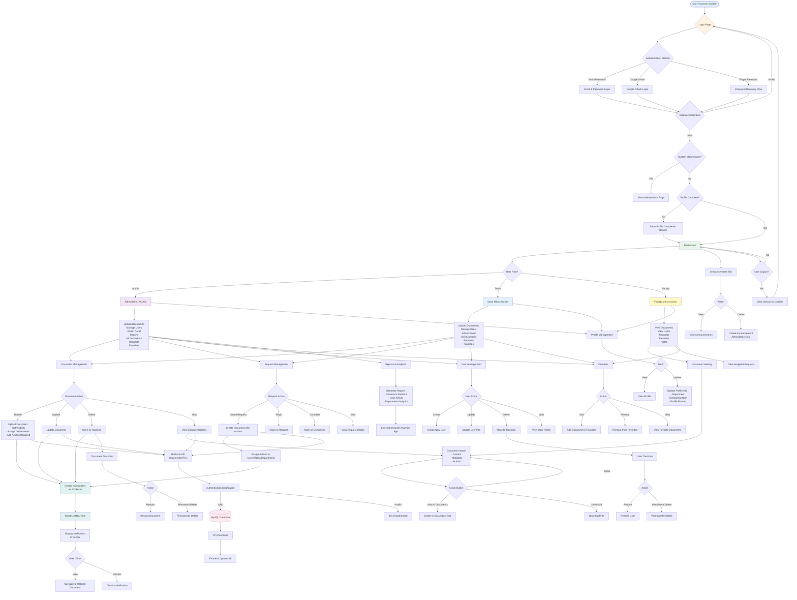

# ISPSC Tagudin Campus Document Management System (DMS)
## Simplified System Flowchart

## System Components Overview

### 1. **Authentication Layer**
- Email/Password Login
- Google OAuth Integration
- Password Recovery (OTP-based)
- Session Management
- JWT Token Authentication

### 2. **User Roles & Permissions**
- **Admin**: Full system access (Upload, Manage Users, Admin Panel, Reports)
- **Dean**: Department-level access (Upload, Manage Users, Admin Panel, No Reports)
- **Faculty**: Limited access (View Documents, View Users, Requests, Favorites)

### 3. **Core Modules**

#### **Document Management**
- Upload documents with metadata
- Set visibility (Public, Department-specific, Role-specific, User-specific)
- Multi-folder support
- Document types categorization
- Update/Delete documents
- Soft delete (Trashcan)
- Document viewing with real-time tracking

#### **Request Management**
- Create documents with action requirements
- Assign actions to users/roles/departments
- Reply to requests
- Track request status (Pending, Completed)
- Department-scoped view for Deans/Faculty

#### **User Management**
- Create/Update/Delete users
- Department assignment
- Role management
- Profile management
- User trashcan

#### **Notifications System**
- Real-time notifications via Socket.io
- Scoped notifications (Department, Role, User, Public)
- Notification types: Added, Updated, Requested, Deleted
- In-app notification display

#### **Announcements**
- Create/view announcements
- Visibility scoping
- Real-time updates

#### **Favorites**
- Bookmark documents
- Quick access to favorite documents

#### **Reports & Analytics**
- Document statistics
- User activity tracking
- Department analytics
- External Streamlit integration

### 4. **Technical Stack**

#### **Frontend**
- React.js with React Router
- React Bootstrap
- Context API (User, Document, Notification)
- Socket.io Client for real-time updates
- Protected Routes

#### **Backend**
- Node.js with Express
- MySQL Database
- Socket.io Server
- RESTful API Architecture
- Authentication Middleware
- Maintenance Mode Support

#### **Database Tables**
- `dms_user` - User accounts
- `dms_documents` - Document records
- `document_departments` - Document-department associations
- `document_folders` - Multi-folder support
- `document_views` - View tracking
- `document_actions` - Action assignments
- `notifications` - Notification records
- `departments` - Department data
- `document_types` - Document categories
- `folders` - Folder structure

### 5. **Data Flow**

1. **User Request** → Frontend Component
2. **API Call** → Backend API Endpoint
3. **Authentication Check** → Middleware validates user
4. **Database Query** → MySQL Database
5. **Response** → JSON data returned
6. **UI Update** → React state update
7. **Real-time Notification** → Socket.io broadcast (if applicable)

### 6. **Security Features**
- Protected routes with role-based access
- Authentication middleware
- Session management
- CORS configuration
- Helmet security headers
- Input validation
- SQL injection prevention

### 7. **Special Features**
- Maintenance mode support
- Profile completion reminders
- Responsive design (Mobile/Desktop)
- Document visibility matrix
- Real-time collaboration
- Soft delete with restore capability
- Multi-folder document organization

